# 🏗️ Jackie AI Assistant - Detailed Architecture

This document provides a comprehensive overview of Jackie's system architecture, technology stack, and data flow patterns.

## 🌐 High-Level System Architecture

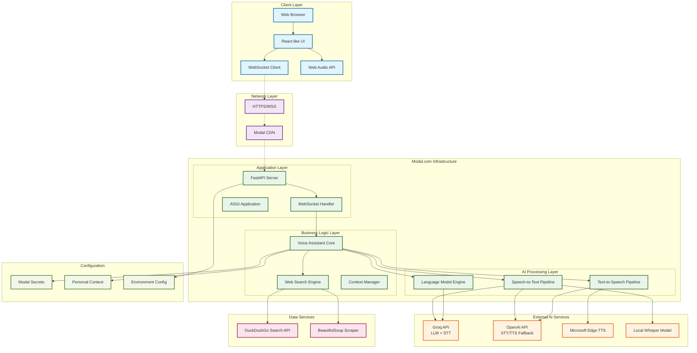

## 🔄 Data Flow Architecture

### **1. Voice Interaction Flow**

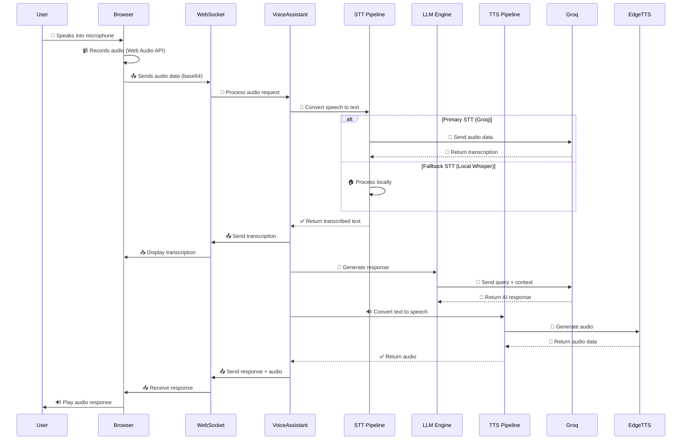

### **2. Web Search Integration Flow**

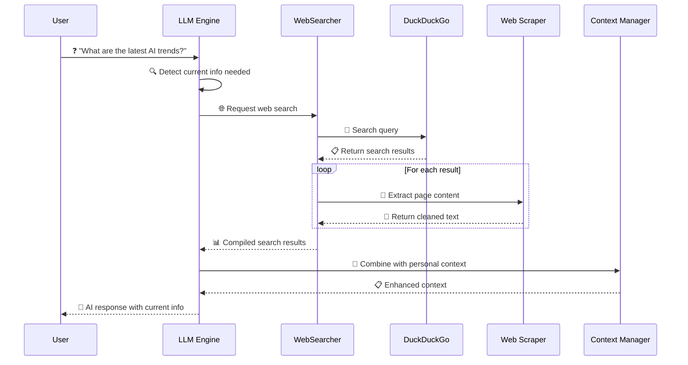

## 🛠️ Technology Stack Breakdown

### **Frontend Technologies**
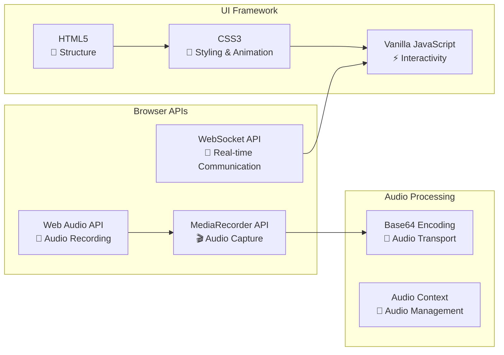

### **Backend Technologies**
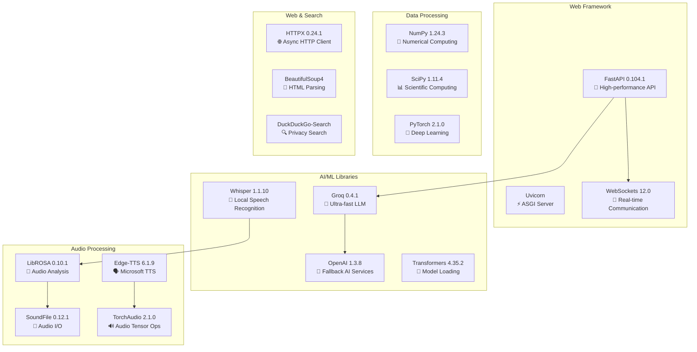

### **Infrastructure & Deployment**
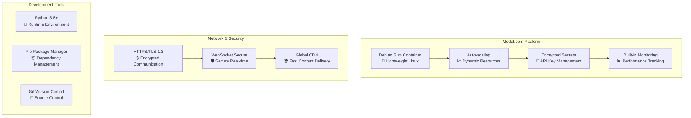

## 🎯 Component Architecture

### **1. Voice Assistant Core**

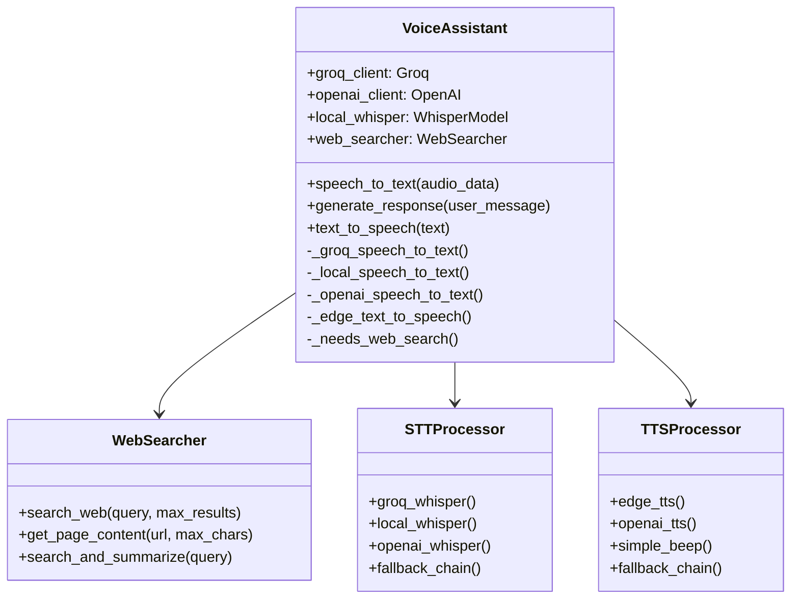

### **2. API Integration Architecture**

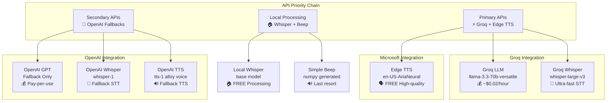

## ⚡ Performance Architecture

### **Response Time Breakdown**

```mermaid
gantt
    title Jackie Response Timeline (Target: <7 seconds)
    dateFormat X
    axisFormat %s

    section Audio Processing
    Audio Capture (Browser)    :0, 1s
    STT Processing (Groq)      :1s, 2s
    
    section AI Processing  
    LLM Generation (Groq)      :2s, 4s
    Web Search (if needed)     :3s, 5s
    
    section Audio Generation
    TTS Processing (Edge)      :4s, 6s
    Audio Playback (Browser)   :6s, 7s
```

### **Scalability Architecture**

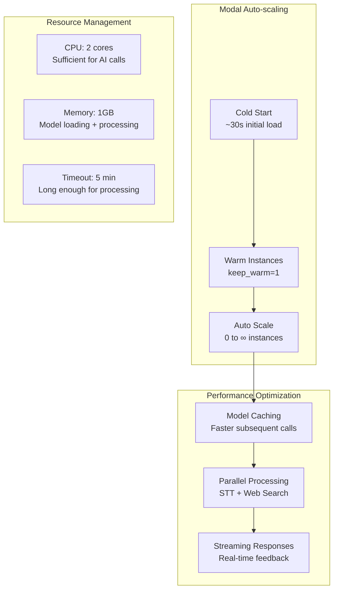

## 🔒 Security Architecture

### **Data Flow Security**

```mermaid
graph TB
    subgraph "Client Security"
        HTTPS_Client[HTTPS Only<br/>🔒 Encrypted transport]
        WSS_Client[WSS Protocol<br/>🛡️ Secure WebSocket]
        NoStorage[No Local Storage<br/>🚫 No data persistence]
    end
    
    subgraph "Application Security"
        EnvVars[Environment Variables<br/>🔐 No hardcoded secrets]
        Secrets_Modal[Modal Secrets<br/>🗝️ Encrypted key storage]
        Isolation[Container Isolation<br/>🏠 Separate instances]
    end
    
    subgraph "API Security"
        APIKey[API Key Rotation<br/>🔄 Regular key updates]
        RateLimit[Rate Limiting<br/>⏱️ Abuse prevention]
        Monitoring[Usage Monitoring<br/>📊 Anomaly detection]
    end
    
    subgraph "Privacy Protection"
        NoLogs[No Conversation Logs<br/>🚫 No data retention]
        Anonymous[Anonymous Usage<br/>👤 No user tracking]
        Personal[Private Context<br/>🔒 Gitignored personal data]
    end

    HTTPS_Client --> WSS_Client
    WSS_Client --> NoStorage
    EnvVars --> Secrets_Modal
    Secrets_Modal --> Isolation
    APIKey --> RateLimit
    RateLimit --> Monitoring
    NoLogs --> Anonymous
    Anonymous --> Personal
```

## 📊 Monitoring & Analytics Architecture

### **Performance Monitoring**

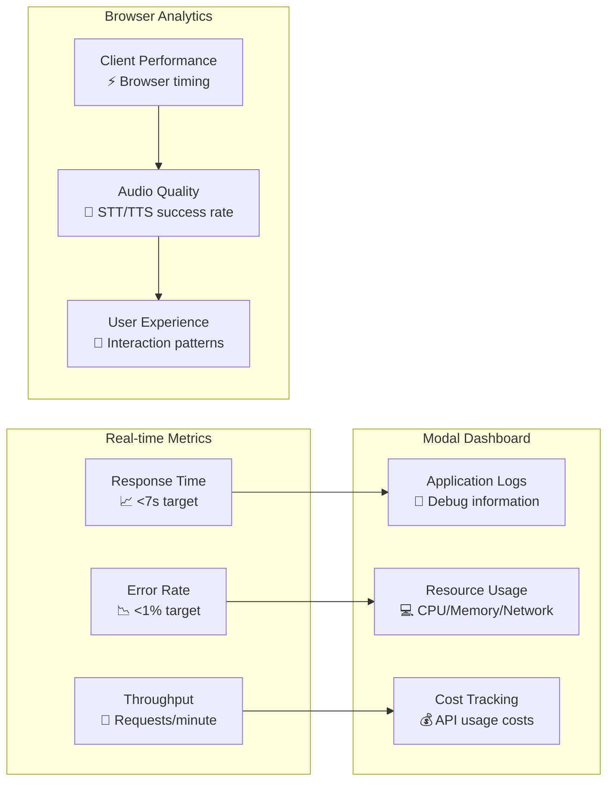

---

## 🚀 Deployment Architecture

### **CI/CD Pipeline**

```mermaid
graph LR
    subgraph "Development"
        LocalDev[Local Development<br/>modal serve]
        Testing[Setup Validation<br/>setup_validator.py]
        Security[Security Check<br/>No secrets in code]
    end
    
    subgraph "Deployment"
        Deploy[Production Deploy<br/>modal deploy]
        Monitor[Health Check<br/>Endpoint monitoring]
        Scale[Auto-scaling<br/>Based on demand]
    end
    
    subgraph "Maintenance"
        Updates[Dependency Updates<br/>Regular security patches]
        Backup[Configuration Backup<br/>Modal secrets backup]
        Monitoring[Performance Monitoring<br/>Continuous optimization]
    end

    LocalDev --> Testing
    Testing --> Security
    Security --> Deploy
    Deploy --> Monitor
    Monitor --> Scale
    Scale --> Updates
    Updates --> Backup
    Backup --> Monitoring
```

This architecture demonstrates a **production-grade AI system** with:

- ⚡ **High Performance**: Sub-second AI inference with Groq
- 🔒 **Enterprise Security**: Encrypted secrets, private data handling
- 📈 **Scalable Infrastructure**: Serverless auto-scaling on Modal
- 🛡️ **Fault Tolerance**: Multiple fallback systems
- 🌐 **Modern Tech Stack**: Latest AI APIs and frameworks
- 📊 **Observability**: Comprehensive monitoring and analytics 