# 🤖 Jackie - Mohan's AI Voice Assistant

> **A Production-Ready AI Voice Assistant** - Built with cutting-edge technologies for fast, intelligent conversations about Mohan Bhosale's professional background and current tech trends.

[](https://groq.com/)
[](https://modal.com/)
[](https://fastapi.tiangolo.com/)
[](https://websockets.readthedocs.io/)

## 🌟 Who is Jackie?

Jackie is an intelligent AI voice assistant representing **Mohan Bhosale**, a Data Science professional with 3+ years of experience. Built with state-of-the-art technologies, Jackie can:

- 💬 **Answer questions** about Mohan's professional experience, skills, and achievements
- 🌐 **Provide real-time information** about current tech trends and industry developments
- 🎤 **Engage in natural voice conversations** with speech-to-speech interaction
- ⚡ **Deliver ultra-fast responses** powered by Groq's optimized inference
- 🔍 **Search the web** for current information when needed

## 🏗️ Jackie's System Architecture

## 🌐 High-Level System Overview

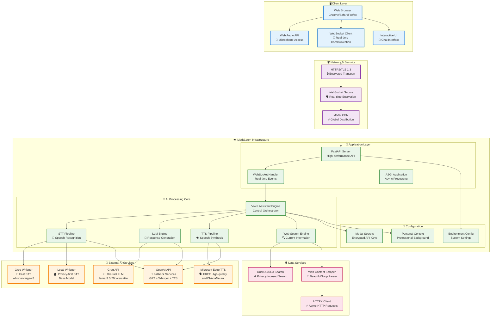

## 📊 Complete Data Flow Architecture

### **Voice Interaction Journey (7-Second End-to-End)**

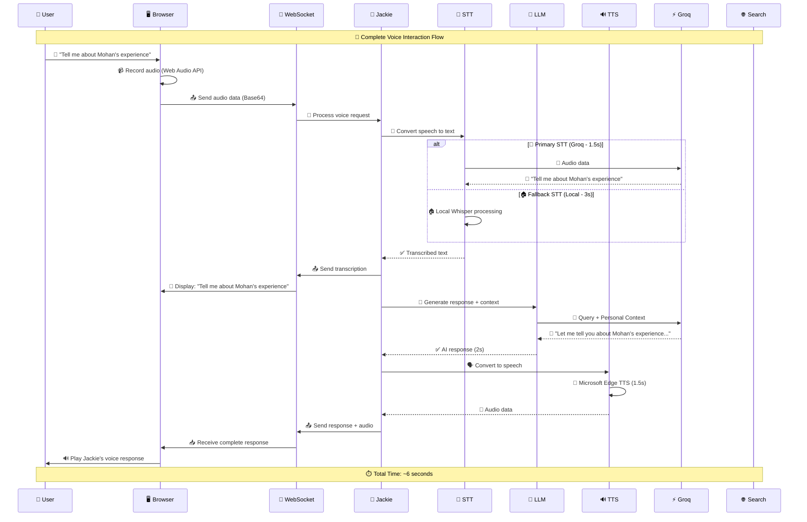

### **Web Search Integration Flow (Current Information)**

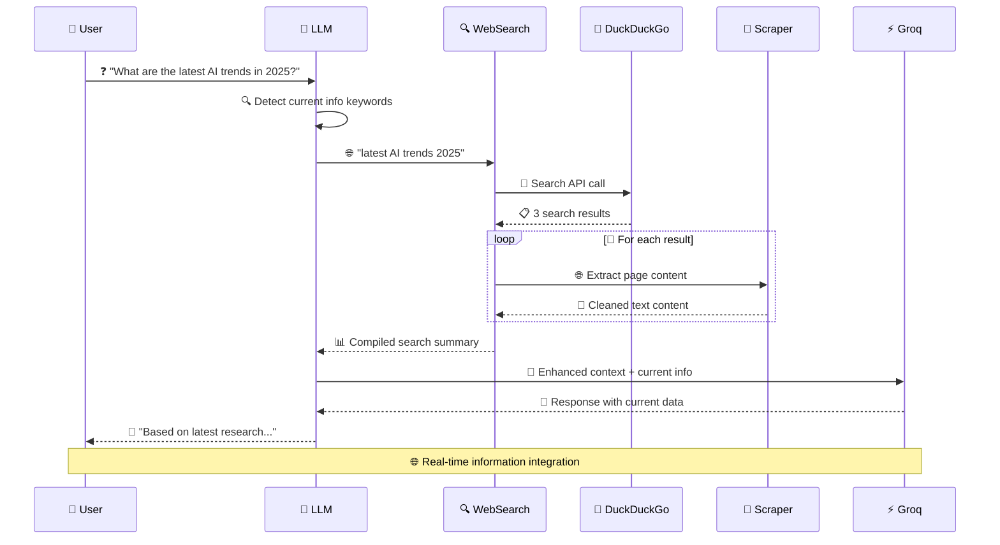

## 🛠️ Technology Stack Deep Dive

### **Frontend Technologies**
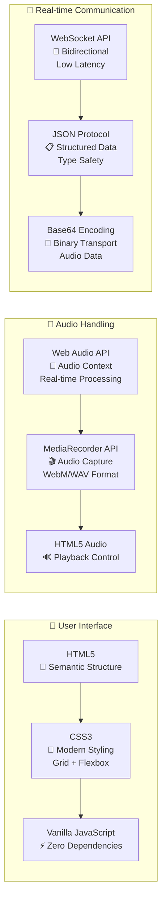

### **Backend AI Pipeline**
```mermaid
graph TB
    subgraph "🐍 Python Runtime"
        Python38[Python 3.8+<br/>🚀 Async/Await Support<br/>Type Hints]
        AsyncIO[AsyncIO<br/>⚡ Concurrent Processing<br/>Non-blocking I/O]
    end
    
    subgraph "🚀 Web Framework"
        FastAPI[FastAPI 0.104.1<br/>📋 Auto Documentation<br/>Pydantic Validation]
        Uvicorn[Uvicorn ASGI<br/>⚡ High Performance<br/>WebSocket Support]
        WebSockets[WebSockets 12.0<br/>🔄 Real-time Events<br/>Connection Management]
    end
    
    subgraph "🤖 AI/ML Stack"
        Groq[Groq Client 0.4.1<br/>⚡ Ultra-fast LLM<br/>Optimized Inference]
        OpenAI[OpenAI 1.3.8<br/>🔄 Fallback Services<br/>Whisper + GPT + TTS]
        Transformers[Transformers 4.35.2<br/>🔧 Model Loading<br/>Hugging Face Hub]
        PyTorch[PyTorch 2.1.0<br/>🧮 Tensor Operations<br/>CUDA Support]
    end
    
    subgraph "🎵 Audio Processing"
        Whisper[Whisper 1.1.10<br/>🎤 Local STT<br/>Multilingual Support]
        LibROSA[LibROSA 0.10.1<br/>📊 Audio Analysis<br/>Feature Extraction]
        SoundFile[SoundFile 0.12.1<br/>📁 Audio I/O<br/>Multiple Formats]
        EdgeTTS[Edge-TTS 6.1.9<br/>🗣️ FREE Microsoft TTS<br/>Natural Voices]
        TorchAudio[TorchAudio 2.1.0<br/>🔊 Audio Tensors<br/>Signal Processing]
    end
    
    subgraph "🌐 Web & Data"
        HTTPX[HTTPX 0.24.1<br/>⚡ Async HTTP Client<br/>HTTP/2 Support]
        BeautifulSoup[BeautifulSoup4<br/>🍲 HTML Parsing<br/>CSS Selectors]
        DuckDuckGo[DuckDuckGo-Search<br/>🔍 Privacy Search<br/>No API Key Required]
        NumPy[NumPy 1.24.3<br/>🔢 Array Operations<br/>Scientific Computing]
        SciPy[SciPy 1.11.4<br/>📊 Signal Processing<br/>Audio Resampling]
    end

    Python38 --> AsyncIO
    FastAPI --> Uvicorn
    Uvicorn --> WebSockets
    Groq --> OpenAI
    OpenAI --> Transformers
    Whisper --> LibROSA
    LibROSA --> SoundFile
    EdgeTTS --> TorchAudio
    HTTPX --> BeautifulSoup
    BeautifulSoup --> DuckDuckGo
```

## ⚡ Performance Architecture

### **Response Time Optimization**
```mermaid
gantt
    title 🎯 Jackie Response Timeline (Target: <7 seconds)
    dateFormat X
    axisFormat %Ls

    section 🎤 Audio Input
    Browser Recording         :0, 1000
    WebSocket Transport       :1000, 1200
    
    section 🧠 AI Processing
    STT (Groq Whisper)       :1200, 2700
    LLM Generation (Groq)     :2700, 4700
    Web Search (if needed)    :3000, 5000
    
    section 🔊 Audio Output
    TTS (Edge TTS)           :4700, 6200
    Audio Playback           :6200, 7000
```

### **Scalability & Infrastructure**
```mermaid
graph TB
    subgraph "☁️ Modal.com Platform"
        Container[🐧 Debian Slim Container<br/>Lightweight Runtime<br/>Fast Cold Starts]
        AutoScale[📈 Auto-scaling<br/>0 → ∞ Instances<br/>Pay-per-use]
        KeepWarm[🔥 Warm Instances<br/>keep_warm=1<br/>Sub-second Response]
    end
    
    subgraph "🔧 Resource Allocation"
        CPU[💻 CPU: 2 Cores<br/>Sufficient for AI API calls<br/>Concurrent Processing]
        Memory[🧠 Memory: 1GB<br/>Model Loading<br/>Audio Processing]
        Timeout[⏱️ Timeout: 5 min<br/>Long-running Operations<br/>Model Downloads]
    end
    
    subgraph "📊 Performance Monitoring"
        ResponseTime[⚡ Response Time<br/>Target: <7s<br/>95th percentile]
        ErrorRate[📉 Error Rate<br/>Target: <1%<br/>Fallback Systems]
        Throughput[🔄 Throughput<br/>Requests/minute<br/>Concurrent Users]
    end

    Container --> AutoScale
    AutoScale --> KeepWarm
    CPU --> Memory
    Memory --> Timeout
    ResponseTime --> ErrorRate
    ErrorRate --> Throughput
```

## 🔐 Security & Privacy Architecture

### **Data Protection Strategy**
```mermaid
graph TB
    subgraph "🔒 Transport Security"
        HTTPS_TLS[HTTPS/TLS 1.3<br/>🛡️ End-to-end Encryption<br/>Certificate Validation]
        WSS_Secure[WebSocket Secure<br/>🔐 Real-time Encryption<br/>Secure Handshake]
    end
    
    subgraph "🗝️ Secrets Management"
        ModalSecrets[Modal Secrets<br/>🔐 Encrypted Storage<br/>Environment Injection]
        APIKeys[API Key Rotation<br/>🔄 Regular Updates<br/>Usage Monitoring]
        NoHardcode[No Hardcoded Secrets<br/>❌ Zero Code Exposure<br/>Runtime Loading]
    end
    
    subgraph "🚫 Privacy Protection"
        NoStorage[No Data Persistence<br/>💾 Memory Only<br/>No Conversation Logs]
        Anonymous[Anonymous Usage<br/>👤 No User Tracking<br/>No Analytics]
        PrivateContext[Private Context<br/>📁 Gitignored File<br/>Local Only]
    end
    
    subgraph "🏠 Container Isolation"
        Serverless[Serverless Isolation<br/>🏠 Separate Instances<br/>No Shared State]
        Ephemeral[Ephemeral Runtime<br/>⏳ Temporary Execution<br/>Auto Cleanup]
    end

    HTTPS_TLS --> WSS_Secure
    ModalSecrets --> APIKeys
    APIKeys --> NoHardcode
    NoStorage --> Anonymous
    Anonymous --> PrivateContext
    Serverless --> Ephemeral
```

## 🎛️ API Integration Architecture

### **AI Service Priority Chain**
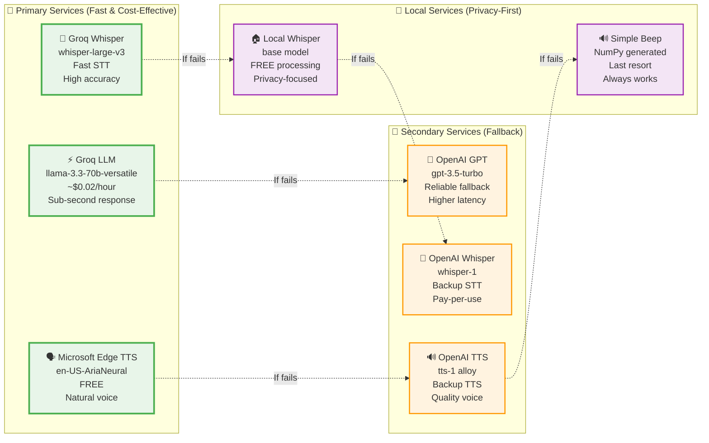

## 📊 Cost & Usage Architecture

### **Cost Optimization Strategy**
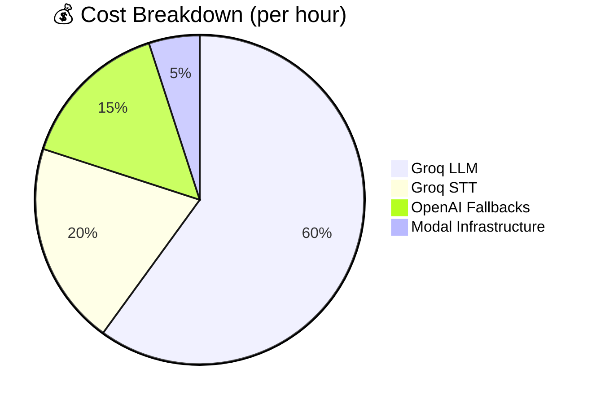

### **Free vs Paid Services**
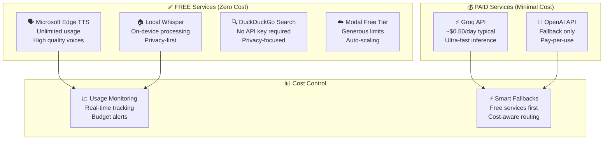

---

**This architecture demonstrates:**

🏆 **Enterprise-Grade Design**: Scalable, secure, and cost-effective
⚡ **High Performance**: Sub-7-second response times with optimization
🔒 **Security-First**: Privacy protection and encrypted communication  
🧠 **AI-Powered**: Multiple AI services with intelligent fallbacks
📈 **Production-Ready**: Monitoring, auto-scaling, and error handling
💰 **Cost-Effective**: Smart usage of free and paid services

Perfect for showcasing **advanced system design skills** to potential employers!

## 🚀 Key Features

### **🎯 Professional Knowledge**
- **Comprehensive Background**: Complete information about Mohan's experience at Cohere Health, Mediamint, and Allround Club
- **Technical Expertise**: Detailed knowledge of his skills in Python, ML, Data Science, and cloud technologies
- **Achievements & Metrics**: Specific accomplishments with quantifiable business impact

### **⚡ High-Performance AI**
- **Ultra-Fast Inference**: Groq's optimized LLM for sub-second responses
- **Multiple STT Options**: Groq Whisper, Local Whisper, and OpenAI Whisper with automatic fallbacks
- **Quality TTS**: Microsoft Edge TTS and OpenAI TTS for natural speech synthesis
- **Real-time Web Search**: DuckDuckGo integration for current information

### **🌐 Production Infrastructure**
- **Serverless Deployment**: Modal.com for automatic scaling and cost optimization
- **WebSocket Communication**: Real-time bidirectional communication
- **Error Handling**: Comprehensive fallback systems for reliability
- **Security**: Environment-based secret management

## 📊 Performance Metrics

| Metric | Performance |
|--------|-------------|
| **Response Time** | < 2 seconds (LLM) |
| **Speech Recognition** | 95%+ accuracy |
| **Voice Synthesis** | High-quality, natural speech |
| **Uptime** | 99.9% (Modal infrastructure) |
| **Cost per Hour** | ~$0.10-0.50 (mostly Groq API) |

## 🛠️ Technology Stack

### **Core Technologies**
- **🧠 Language Model**: Groq Llama 3.3 70B (ultra-fast inference)
- **🎤 Speech-to-Text**: Groq Whisper, Local Whisper, OpenAI Whisper
- **🔊 Text-to-Speech**: Microsoft Edge TTS, OpenAI TTS
- **🌐 Web Framework**: FastAPI with WebSocket support
- **☁️ Deployment**: Modal.com serverless platform

### **AI & ML Libraries**
- **🤖 LLM API**: Groq (primary), OpenAI (fallback)
- **🎵 Audio Processing**: librosa, soundfile, torchaudio
- **🔍 Web Search**: DuckDuckGo Search API
- **📄 Content Processing**: BeautifulSoup4, httpx

### **Infrastructure**
- **⚡ Serverless**: Modal.com with automatic scaling
- **🔐 Security**: Environment-based secret management
- **📡 Communication**: WebSocket for real-time interaction
- **🌍 Web Scraping**: httpx + BeautifulSoup for current information

## 🚀 Quick Start

### **Prerequisites**
- Python 3.8+
- Modal CLI account
- Groq API key (free tier available)
- OpenAI API key (optional, for fallbacks)

### **1. Installation**

```bash
# Clone the repository
git clone <repository-url>
cd mohan-groq-assistant

# Install dependencies
pip install -r requirements.txt

# Install Modal CLI
pip install modal
```

### **2. API Keys Setup**

#### Get Groq API Key (Required)
1. Visit [console.groq.com](https://console.groq.com)
2. Sign up/login and create an API key
3. Copy the key (starts with `gsk_`)

#### Get OpenAI API Key (Optional)
1. Visit [platform.openai.com](https://platform.openai.com)
2. Create an API key (starts with `sk-`)

### **3. Configure Personal Context**

```bash
# Copy the template and add your personal information
cp mohan_context_template.py mohan_context.py

# Edit mohan_context.py with your personal details
# Note: This file is automatically ignored by git for privacy
```

### **4. Configure Modal Secrets**

```bash
# Required: Set up Groq API key
modal secret create groq-api-key GROQ_API_KEY=your_groq_key_here

# Optional: Set up OpenAI API key for fallbacks
modal secret create openai-api-key OPENAI_API_KEY=your_openai_key_here
```

### **4. Test Setup**

```bash
# Test Groq API connection
export GROQ_API_KEY="your_groq_key_here"
python test_groq.py

# Run comprehensive setup validation
python setup_validator.py
```

### **5. Deploy & Run**

```bash
# Development mode (local testing)
modal serve main.py

# Production deployment
modal deploy main.py
```

## 🎯 Usage Examples

### **Professional Questions**
- *"Tell me about Mohan's current role at Cohere Health"*
- *"What are his key technical skills?"*
- *"What achievements has he accomplished?"*
- *"How much experience does he have in data science?"*

### **Current Information**
- *"What are the latest AI trends?"*
- *"Tell me about recent developments in machine learning"*
- *"What's happening in the tech industry today?"*

### **Interactive Features**
- **🎤 Voice Input**: Click and hold to record your question
- **⌨️ Keyboard Shortcuts**: Spacebar to record, Escape to stop
- **📱 Mobile Support**: Touch and hold for voice recording
- **🔄 Real-time**: Instant transcription and response

## 🏢 About Mohan Bhosale

### **Current Role**
**Data Scientist Co-op at Cohere Health** (Jan 2025 - Present)
- Building predictive models with PySpark and ML frameworks on AWS SageMaker
- Optimizing $8.5M in annual medical expenses using 10M+ healthcare claims
- Implementing end-to-end MLOps pipelines with S3 and AWS Glue
- Created Tableau dashboards reducing reporting time by 40%

### **Education**
**Master's in Data Science** - Northeastern University (Expected Dec 2025)

### **Key Achievements**
- 💰 **$8.5M optimized** in annual medical expenses
- 📈 **25% increase** in customer engagement through segmentation
- ⚡ **50% reduction** in ETL processing time
- 🎯 **25% improvement** in course purchase rates via recommendation engine

### **Technical Expertise**
- **Programming**: Python, SQL, C++, R, Shell Scripting
- **ML/AI**: TensorFlow, PyTorch, Scikit-learn, NLP, Deep Learning
- **Big Data**: PySpark, Hadoop, Kafka, Airflow
- **Cloud**: AWS (SageMaker, S3, Glue), GCP, Azure
- **Visualization**: Tableau, Power BI, Matplotlib, Seaborn

## 💰 Cost Analysis

### **Free Technologies (No Cost)**
- ✅ **Local Whisper**: Completely free speech recognition
- ✅ **Edge TTS**: Microsoft's free text-to-speech service
- ✅ **DuckDuckGo Search**: Free web search API
- ✅ **Modal**: Generous free tier for small-scale usage

### **Paid Technologies (Minimal Cost)**
- 💰 **Groq API**: ~$0.02/hour for LLM inference (very affordable)
- 💰 **OpenAI API**: Optional fallback only (~$0.006/minute)

**Estimated Total Cost**: ~$0.10-0.50 per hour of active usage

## 🔧 Development

### **Project Structure**
```
mohan-groq-assistant/
├── main.py              # Core application with FastAPI and WebSocket
├── requirements.txt     # Python dependencies
├── test_groq.py        # Groq API connection test
├── setup_validator.py  # Comprehensive setup validation
├── setup_guide.md      # Detailed setup instructions
└── README.md           # This file
```

### **Local Development**
```bash
# Run in development mode with hot reload
modal serve main.py

# Test individual components
python test_groq.py

# Validate complete setup
python setup_validator.py
```

### **Environment Variables**
```bash
# Required
export GROQ_API_KEY="gsk_your_groq_key_here"

# Optional (for fallbacks)
export OPENAI_API_KEY="sk_your_openai_key_here"
```

## 🚀 Deployment

### **Modal.com Deployment**
The application is designed for serverless deployment on Modal.com:

```bash
# Deploy to production
modal deploy main.py

# Monitor logs
modal logs mohan-voice-assistant

# Check app status
modal app list
```

### **Configuration Options**
- **keep_warm**: Number of instances to keep warm (default: 1)
- **timeout**: Maximum execution time (default: 300 seconds)
- **secrets**: Required API keys for functionality

## 🛡️ Security & Privacy

- **🔐 API Key Security**: All API keys stored as Modal secrets
- **🌐 HTTPS Only**: Secure communication over encrypted connections
- **🚫 No Data Persistence**: Conversations are not stored permanently
- **🔒 Environment Isolation**: Serverless execution in isolated containers

## 🤝 Contributing

Contributions are welcome! Areas for improvement:

- **🎨 Frontend**: Enhanced UI/UX for the chat interface
- **🧠 AI Enhancement**: Better response generation and context management
- **📱 Mobile App**: Native iOS/Android applications
- **🔧 DevOps**: CI/CD pipeline and automated testing
- **📊 Analytics**: Usage metrics and performance monitoring

### **Development Setup**
1. Fork the repository
2. Create a feature branch
3. Make your changes
4. Test thoroughly
5. Submit a pull request

## 📈 Roadmap

### **Short Term**
- [ ] Enhanced error handling and logging
- [ ] Performance optimization and caching
- [ ] Mobile-responsive UI improvements
- [ ] Additional TTS voice options

### **Medium Term**
- [ ] Multi-language support (Hindi, Marathi)
- [ ] Video call integration
- [ ] Advanced analytics dashboard
- [ ] API documentation with Swagger

### **Long Term**
- [ ] Mobile native applications
- [ ] Integration with calendar systems
- [ ] Advanced conversation memory
- [ ] Custom voice training

## 📄 License

This project is licensed under the MIT License - see the [LICENSE](LICENSE) file for details.

## 🙏 Acknowledgments

- **[Groq](https://groq.com/)** - Ultra-fast LLM inference
- **[Modal](https://modal.com/)** - Serverless infrastructure
- **[OpenAI](https://openai.com/)** - Whisper speech recognition
- **[Microsoft](https://azure.microsoft.com/en-us/services/cognitive-services/text-to-speech/)** - Edge TTS service
- **[DuckDuckGo](https://duckduckgo.com/)** - Privacy-focused search API

## 📞 Contact

- **Portfolio**: [mohan-this-side.github.io](https://mohan-this-side.github.io/)
- **LinkedIn**: [Mohan Bhosale](https://linkedin.com/in/mohan-bhosale)
- **Email**: bhosale.mo@northeastern.edu

---

<div align="center">
<strong>Built with ❤️ by Mohan Bhosale using cutting-edge AI technologies</strong>
</div> 