# 🤖 Jackie - AI Voice Assistant

> **Fast, intelligent voice conversations powered by Groq and Modal.com**

[](https://groq.com/)
[](https://modal.com/)
[](https://fastapi.tiangolo.com/)
[](https://websockets.readthedocs.io/)

## 🎯 Who is Jackie?

Jackie is an AI voice assistant that can:
- 💬 **Answer questions** about professional experience and skills
- 🌐 **Search the web** for current information
- 🎤 **Voice conversations** with natural speech-to-speech interaction
- ⚡ **Ultra-fast responses** powered by Groq's optimized inference

## 🏗️ System Architecture & Data Flow

```mermaid
%%{init: {theme: 'forest',
  layout: 'elk',
  look: 'neo'}}%%
flowchart TD
    subgraph "🌐 Client"
        A[Web Browser] --> B[🎤 Voice Input]
        A --> C[💬 Chat Interface]
    end
    
    subgraph "☁️ Modal.com Infrastructure"
        D[FastAPI Server] --> E[WebSocket Handler]
        E --> F[🧠 Voice Assistant Engine]
    end
    
    subgraph "🎤 Speech Processing"
        F --> G[Speech-to-Text]
        G --> G1[Groq Whisper]
        G --> G2[Local Whisper]
        G --> G3[OpenAI Whisper]
    end
    
    subgraph "🤖 AI Processing"
        F --> H[LLM Engine]
        H --> H1[Groq API<br/>llama-3.3-70b]
        H --> H2[OpenAI GPT<br/>Fallback]
        
        F --> I[🔍 Web Search]
        I --> I1[DuckDuckGo API]
        I --> I2[Web Scraper]
    end
    
    subgraph "🗣️ Speech Synthesis"
        F --> J[Text-to-Speech]
        J --> J1[Microsoft Edge TTS<br/>FREE]
        J --> J2[OpenAI TTS<br/>Premium]
    end
    
    subgraph "🔐 Configuration"
        K[API Keys<br/>Modal Secrets]
        L[Personal Context<br/>Professional Info]
    end
    
    %% Data Flow
    B --> E
    E --> F
    G1 -.-> H1
    H1 --> J1
    J1 --> C
    
    %% Search Flow
    H1 -.-> I1
    I1 --> I2
    I2 -.-> H1
    
    %% Configuration
    F -.-> K
    F -.-> L
    
    %% Response Path
    J1 --> E
    E --> A
    
    %% Styling with forest theme colors
    classDef client fill:#c8e6c9,stroke:#2e7d32,stroke-width:3px
    classDef modal fill:#a5d6a7,stroke:#388e3c,stroke-width:3px
    classDef ai fill:#81c784,stroke:#43a047,stroke-width:3px
    classDef config fill:#66bb6a,stroke:#2e7d32,stroke-width:2px
    
    class A,B,C client
    class D,E,F modal
    class G,G1,G2,G3,H,H1,H2,I,I1,I2,J,J1,J2 ai
    class K,L config
```



## 🚀 Quick Start

### Prerequisites
- Python 3.9+
- Modal.com account
- Groq API key

### Installation

1. **Clone the repository**
   ```bash
   git clone https://github.com/Mohan-this-side/Jackie-Personal-AI-Voice-Assistant.git
   cd Jackie-Personal-AI-Voice-Assistant
   ```

2. **Install dependencies**
   ```bash
   pip install -r requirements.txt
   ```

3. **Setup environment variables**
   ```bash
   cp mohan_context_template.py mohan_context.py
   # Edit mohan_context.py with your information
   ```

4. **Configure Modal secrets**
   ```bash
   modal secret create groq-secret GROQ_API_KEY=your_groq_key
   modal secret create openai-secret OPENAI_API_KEY=your_openai_key
   ```

5. **Deploy to Modal**
   ```bash
   modal deploy main.py
   ```

## 🛠️ Technology Stack

| Component | Technology | Purpose |
|-----------|------------|---------|
| **Backend** | FastAPI + WebSocket | Real-time communication |
| **AI/LLM** | Groq API (Llama 3.3 70B) | Ultra-fast language model |
| **Speech-to-Text** | Groq Whisper, Local Whisper | Voice recognition |
| **Text-to-Speech** | Microsoft Edge TTS, OpenAI | Voice synthesis |
| **Web Search** | DuckDuckGo API | Current information |
| **Infrastructure** | Modal.com | Serverless deployment |
| **Security** | Modal Secrets | Encrypted API keys |

## 📁 Project Structure

```
📦 Jackie-Personal-AI-Voice-Assistant/
├── 🐍 main.py                    # Main application
├── 📋 requirements.txt           # Dependencies
├── 🔧 setup_validator.py         # Environment validation
├── 🚀 deploy.sh                  # Deployment script
├── 📚 README.md                  # Documentation
├── 🏗️  ARCHITECTURE.md           # Detailed architecture
├── 🔒 SECURITY.md                # Security guidelines
├── 📖 setup_guide.md             # Setup instructions
├── 📄 LICENSE                    # MIT License
├── 🔐 mohan_context_template.py  # Context template
└── 🧪 test_groq.py               # API testing
```

## 🎮 Usage

### Web Interface
1. Open the Modal app URL in your browser
2. Click the microphone button to start voice conversation
3. Speak your question naturally
4. Jackie responds with both text and voice

### Example Conversations
- *"Tell me about your experience in data science"*
- *"What are the latest trends in AI?"*
- *"What technologies do you work with?"*
- *"Search for recent developments in machine learning"*

## ⚡ Performance

- **Response Time**: ~3-7 seconds end-to-end
- **STT Processing**: 1-2 seconds (Groq Whisper)
- **LLM Generation**: 2-3 seconds (Groq API)
- **TTS Synthesis**: 1-2 seconds (Edge TTS)
- **Concurrent Users**: Scales automatically on Modal

## 🔒 Security Features

- ✅ Encrypted API keys via Modal Secrets
- ✅ HTTPS/WSS secure communication
- ✅ No sensitive data in repository
- ✅ Privacy-focused web search (DuckDuckGo)
- ✅ Configurable personal context

## 🤝 Contributing

1. Fork the repository
2. Create a feature branch (`git checkout -b feature/amazing-feature`)
3. Commit your changes (`git commit -m 'Add amazing feature'`)
4. Push to the branch (`git push origin feature/amazing-feature`)
5. Open a Pull Request

## 📄 License

This project is licensed under the MIT License - see the [LICENSE](LICENSE) file for details.

## 🙏 Acknowledgments

- [Groq](https://groq.com/) for lightning-fast LLM inference
- [Modal.com](https://modal.com/) for seamless serverless deployment
- [FastAPI](https://fastapi.tiangolo.com/) for the robust web framework
- [OpenAI](https://openai.com/) for Whisper and GPT models

---

<div align="center">
<strong>Built with ❤️ by Mohan Bhosale</strong><br/>
<em>Showcasing modern AI technologies in a production-ready voice assistant</em>
</div> 